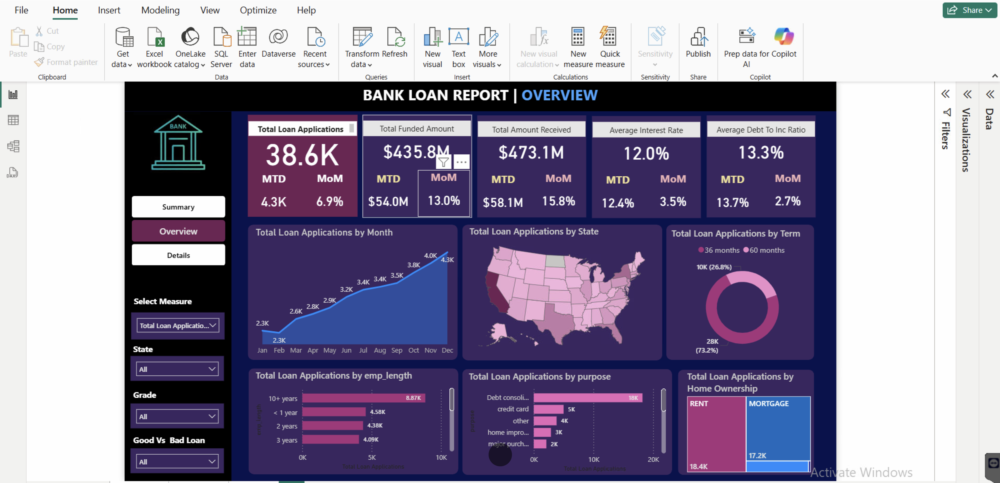

# Bank_Loan_Analysis_Project
30/09/2025

Today, I will be writing the write-up for this project.
## 📌 Project Overview
### 🔍 Objectives
I built an end-to-end interactive <b>bank loan dashboard in Power BI, anchored by SQL queries</b> and a clearly defined problem statement. The dashboards give a bank or financial institution a holistic view of loan portfolio health, with a focus on <b>KPI tracking, loan status analysis, and drill-down insights.</b> 
  
This project is designed to be practical for real-world analytics roles, showing how to move from raw data to decision-ready visuals and documentation.
  
<h5>What I delivered:</h5>

1.  A three-dashboard portfolio: Summary KPI dashboard, Overview dashboard with deeper analytics, and a Details/Grid view.

2.	Dynamic, filter-driven visuals that let stakeholders explore loan data by state, grade, home ownership, loan purpose, term, and more.
   
3.	SQL-based data preparation and validation, backed by a documented problem statement and data-domain knowledge to ensure business relevance.
   
4.	Power BI features including KPI visuals, field parameters for dynamic measures, and smooth navigation between dashboards.  

---

### 📊 Data and Domain Knowledge

#### Data Dictionary

This project is based on a financial loan dataset wchich contains 24 attributes. Below is the detailed data dictionary:

| Column Name                    | Data Type  | Description                                                                       |
| ------------------------------ | ---------- | --------------------------------------------------------------------------------- |
| **Loan_ID**                    | String     | Unique identifier for each loan application                                       |
| **Address_State**              | String     | U.S. state of the borrower’s residence                                            |
| **Application_Type**           | String     | Indicates if the application is Individual or Joint                               |
| **Employee_Length**            | String     | Borrower’s employment length (e.g., `< 1 year`, `10+ years`)                      |
| **Employee_Title**             | String     | Borrower’s job title as reported                                                  |
| **Grade**                      | String     | Credit grade assigned to the loan (A–G)                                           |
| **Sub_Grade**                  | String     | Sub-grade classification (e.g., A1, B3)                                           |
| **Home_Ownership**             | String     | Housing status (`Rent`, `Mortgage`, `Own`, `Other`)                               |
| **Issue_Date**                 | Date       | Date when the loan was issued                                                     |
| **Last_Credit_Pull_Date**      | Date       | Most recent date the borrower’s credit was reviewed                               |
| **Last_Payment_Date**          | Date       | Most recent repayment date recorded                                               |
| **Next_Payment_Date**          | Date       | Scheduled date for the next repayment                                             |
| **Loan_Status**                | String     | Current status (`Fully Paid`, `Current`, `Charged Off`)                           |
| **Member_ID**                  | String     | Borrower’s unique member identifier                                               |
| **Purpose**                    | String     | Purpose of the loan (e.g., `Debt Consolidation`, `Car`, `Medical`, `Credit Card`) |
| **Term**                       | Integer    | Loan term length (`36 months` or `60 months`)                                     |
| **Verification_Status**        | String     | Income verification status (`Verified`, `Not Verified`, `Source Verified`)        |
| **Annual_Income**              | Numeric    | Borrower’s stated annual income                                                   |
| **Loan_Amount**                | Numeric    | Original amount of the loan applied for                                           |
| **Funded_Amount**              | Numeric    | Amount actually funded/disbursed by the bank                                      |
| **Installment**                | Numeric    | Monthly EMI repayment amount for the borrower                                     |
| **Interest_Rate**              | Percentage | Interest rate applied to the loan                                                 |
| **Total_Payment**              | Numeric    | Total amount repaid by the borrower (principal + interest)                        |
| **DTI (Debt-to-Income Ratio)** | Percentage | Ratio of borrower’s debt to income, used to assess repayment capacity             |

This dictionary serves as a **reference for SQL queries, Power BI measures, and dashboard visuals** that I have created in this project.

**•	Data set:** Bank loan data with roughly 38k rows and 24 fields (e.g., ID, address_state, application_type, emp_length, loan_amount, total_payment, int_rate, loan_status etc.).

**•	Domain concepts I relied on:**

  *	Loan types and statuses (good loans: current or fully paid; bad loans: charged off).

  *	Core metrics: total loan applications, total funded amount, total amount received, month-to-date (MTD) values, and month-on-month (MOM) changes.

  *	Business terms such as DTI (debt-to-income ratio), loan term (e.g., 36/60 months), home ownership status, loan purposes, etc.

**•	Domain Knowledge Documents:** I used reference materials from the course materials to define problem statements, domain terminology, and metric interpretations which I have uploaded in my documents folder of this project.

---

### 🔍 What I built (Power BI Dashboard)
#### 1.	Summary Dashboard (KPI-first view)
* Core KPIs I implemented:
  *	Total loan applications (count of loan IDs)
  *	Total funded amount (sum of loan amounts disbursed)
  * Total amount received (sum of total payments received)
  *	MTD and MOM changes for these measures
  *	Average interest rate and average DTI
*	Visuals I used:
    *	KPI cards for the core metrics
    *	A high-level view of loan status distribution (good vs. bad loans)
    *	A donut chart showing the proportion of good vs. bad loans
*	Interactivity:
    *	Filters by state, grade, home ownership, loan purpose, and other fields
    *	Dynamic header and chart titles that reflect the selected measures
    *	Field parameters to toggle between different measures (total applications, funded amount, amount received)
#### 2.	Overview Dashboard (Deep-dive analytics)
*	Key views I included:
    *	Monthly trends by issue date (line chart showing applications, funded amount, and amount received)
    * Regional analysis by state (map or regional visualization)
    *	Loan term analysis (donut chart by term)
    *	Employee length analysis (bar chart by years of experience)
    *	Home ownership and loan purpose breakdowns (tree map and stacked visuals)
*	SQL validation:
    *	All visuals are supported by SQL queries that reproduce the same results as shown in Power BI
    *	I followed a problem-statement-driven approach to ensure business relevance
*	Interactivity:
    *	Slicers for state, grade, and loan purpose
    *	Subtle, readable formatting with a consistent color palette
    *	Cross-filtering among charts for cohesive insights
#### 3.	Details Dashboard (Grid view)
*	A detailed table view of loans with fields like loan ID, issue date, home ownership, grade, subgrade, funded amount, interest rate, installments, and amount received
*	Secondary visuals to summarize per-row metrics without losing granular context
*	Presentation:
    *	Clean grid with readable formatting, aligned headers, and legible font sizing
    *	Focus on enabling stakeholders to inspect individual loans while keeping broader trends visible

---

### How I reproduced this work
#### Data preparation: (SQL)
*	I started from the 38k-row bank loan dataset with 24 fields.
*	I validated data quality (nulls, field existence, data types) and cleaned data.
*	I prepared SQL queries to compute:
    *	Total loan applications
    * Total funded amount
    * Total amount received
    *	MOM and MTD metrics
    * Average interest rate and average DTI
*	I created domain knowledge and terminology documents to support interpretation of fields (loan status, purpose, home ownership, etc.).
#### Database setup (SQL Server):
    *	I created a database (e.g., Bank_Loan_DB).
    *	I imported the CSV data into a table (e.g., financial_loan).
    *	I verified that all fields map correctly (ID as primary key, and all the appropriate data types).
#### SQL validation/documentation:
    *	I maintained a “Query Document” that records every SQL query used and the corresponding results in Visual Studio Code.
    *	I saved snapshots of key results to compare with Power BI outputs.
#### Power BI workflow:
* Data source: Imported from SQL Server (or a flat CSV workflow if needed).
    *	I built three dashboards on separate pages: Summary, Overview, and Details.
    *	I created measures using DAX for KPIs, MOM/MTD calculations, and dynamic field parameter-based charts.
    * I designed visuals with a consistent color palette and readable typography.
    *	I added slicers for state, grade and purpose; configured a field parameter to switch between core measures.
    *	I implemented navigation between dashboards using page navigation buttons.

---

**Here is a shortcut to screenshots of different dashboards that I built (which I have also pasted down below).**

  
  

---

### Onboarding Instructions (How you can too run this project on your local PC)

1. Clone this repository

2. Import the SQL file from `sql/retrieve_data.sql` into your database

3. Open Power BI and connect to your SQL Server or flat file.

4. Load the `documents /Bank_loan_Db.pbix` to explore dashboards 

---
---
## End Of Project
---
---
26/09/2025
I am going to add the first power Bi file and image of the dashboard that I have built. After completing all the dashboards I am going to write the complete write up for this project.

I am going to add one more image of the same dashboard by selecting the option from the slicer and as these slicers have a lot of other options I am just going to add one screenshot.

27/09/2025

Today I have added some more features to the dashboards and added one more dashboard pages to this report that I am working on.

This page is about the Overview of the measure which I am going to showcase using some screenshots of the dashbords.

Please take a look on the screenshots that I am going to add now.

-- Total Funded Amount Overview 

-- Total loan application overview

--Total Amount recieved measure overview

-- I have also added interaction to the overview page as when one of the KPI is clicked the whole page shows according to the selected KPI

Here I have selected term as 36 months and the whole overview page is showing according to this page 

